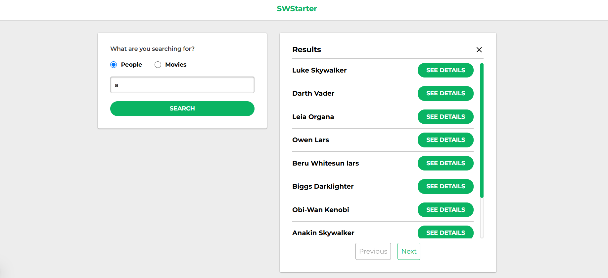
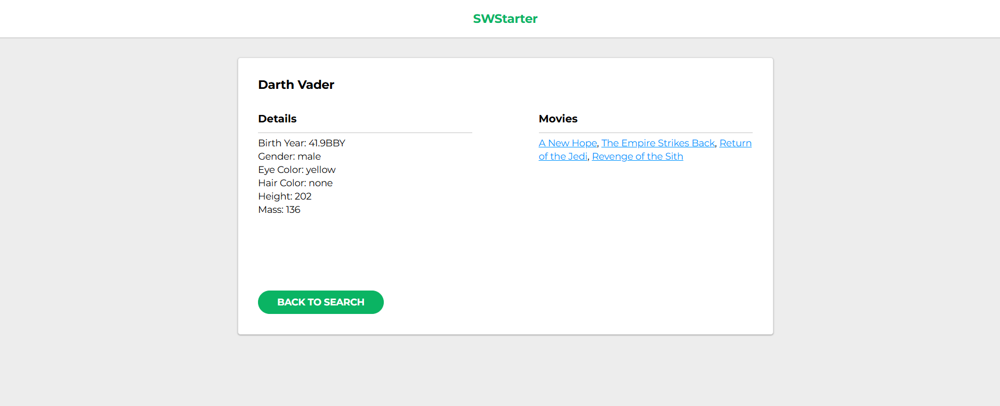
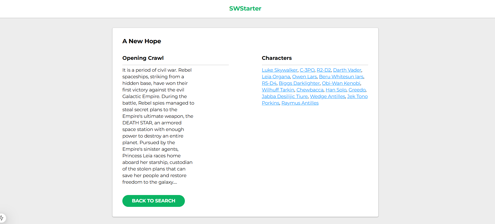
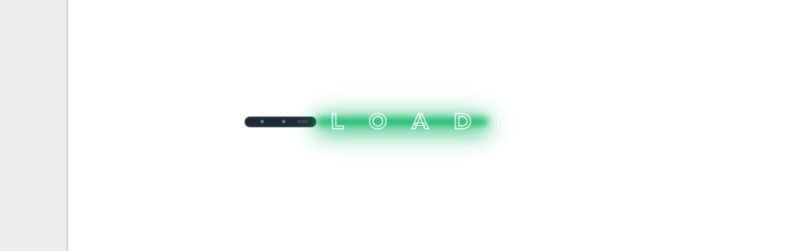
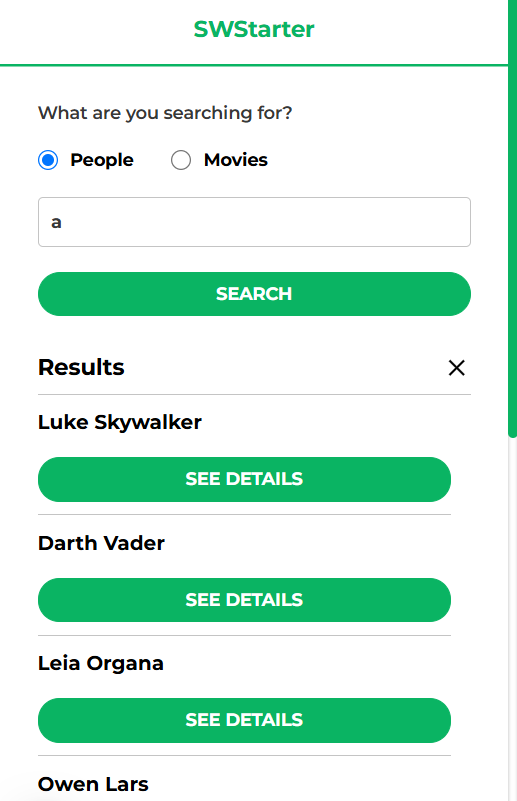
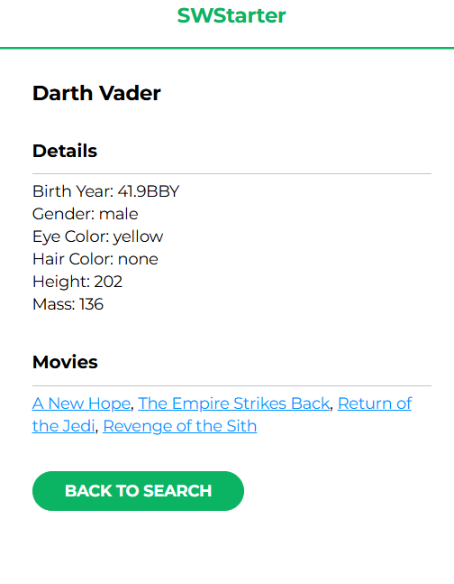
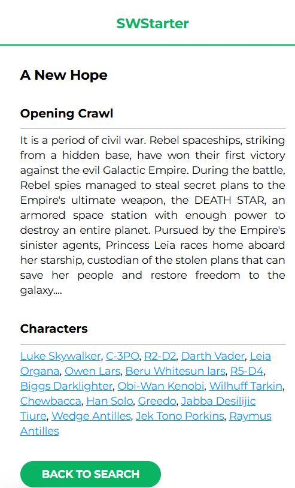

## Overview

This is a 100% responsive Fullstack application using Next.js where you can interact with the Star Wars API (SWAPI) to search for characters or movies and see their details.

## Tech stack

I used Next.js, React, Typescript, Tailwind, Firebase, Jest, React Testing Library, React Icons and Node.js

## Node version
This project requires at least version 20 of Node to be able to run all the features without any problems.
You can easily download the 20 or higher version using nvm:
Run in your terminal `nvm install v20`, then you need to run `nvm use 20`
After running this and selecting the version 20, you should proceed to the next step.

## Running the project

Obs: To run it locally, you will need to create your own firebase store and replace all the config inside `firebase.ts` with your own credentials.

To run the development version, run `npm install` to install all the dependencies.
Then create a `.env.local` file in the root of the project and add the following:
`NEXT_PUBLIC_BASE_URL=http://localhost:3000`
`FIREBASE_CONFIG_API_KEY=YOUR FIREBASE API KEY GOES IN HERE`

Then you should be able to run `npm run dev` to initialize the development version.

## Running using Docker
You need to install Docker in your machine if you haven't already.
Once you do, make sure to create the `.env` file with the following:
`NEXT_PUBLIC_BASE_URL=http://localhost:3000`
`FIREBASE_CONFIG_API_KEY=YOUR FIREBASE API KEY GOES IN HERE`

Obs: Before you run docker compose, make sure you create your own firebase store and replace all the config inside `firebase.ts` with your own credentials.

After creating the `.env` file, you should be able to run `docker compose up -d`
Once it finishes building, open `http://localhost:3000` and you should be able to use the application

## Vercel hosted version
You can find the vercel hosted version here: https://starwars-wiki-zeta.vercel.app/

## Desktop

## Custom Loading Screen.

## Mobile 

